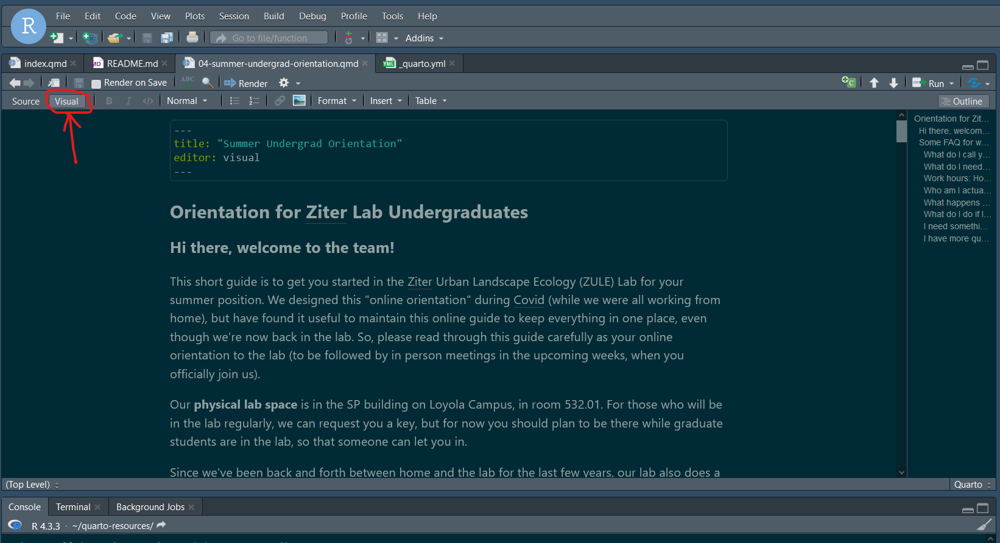

## Hello!

::: columns
::: column

:::

::: column
This website is for hosting all the important/most commonly used resources from the ZULE Lab. Feel free to use the search function to find what you need or check out the left sidebar for different categories, and then click on whatever topic is most relevant to you to get the info you need!
:::
:::

## Are we missing something?

We want to know about datasets/resources you have been using, so we can add them here! If you want to contribute a resource to this page, you can:

-   Collaborating directly as a collaborator through GitHub ([Instructions for collaborators])

-   make a pull request

-   message Bella on Zulip and say what you think is missing

## TO-DO

-   add fieldwork guide
-   lab meeting slides
-   example metadata + instructions
-   link to repositories

## Instructions for collaborators

So you're in the lab and you want want to push/pull/edit/add/remove documents without restrictions! Awesome, thanks for helping us keep our resources up to date. Here is a step-by-step list of how to go about it:

1.  Get added as a member of the repository as a Maintainer. Right now, you can ask Bella, Carly, or Nicole to do this for you

2.  You need to clone this repository to your device. There are many ways to do this - choose which way works for you.

    -   Probably the easiest is to install [GitHub Desktop](https://desktop.github.com/), sign in to GitHub, and then select File -\> Clone Repository. It will list all repositories associated with your account, choose this one (zule-lab/biol226-resource-book).

3.  Open GitHub Desktop (or whatever way you manage Git locally), and *pull*. Since this is a collaborative project, you need to fetch/pull before you make changes.

    

4.  Navigate to the where the folder was cloned to.

5.  Open the project folder. Double-click on resources-base.Rproj . This should open an RStudio window with the project loaded

    

6.  The individual documents are sorted into three folders: policies/ , spatial-resources/ , and other-resources/ . Within each folder, you can select the relevant file individually and edit it. If you have a relatively new version of RStudio, you should be able to edit these files using "Visual" mode, meaning that you can interact with it much like you would a word file (i.e., you can click to insert photos, the formatting is rendered, etc.)

    

7.  When you have made the changes you would like to make, save the file(s) and type `quarto render` into the R terminal. This will render all the changes you made and create an updated html file. It may take a couple minutes.

    

8.  You can now find the locally updated file in the docs folder of the directory (index.html)

9.  Commit and push your changes (this will look different depending on what method/software you use), the website will take \~ 5 minutes to recompile and then you can visit it directly online to view any changes (<https://zule-lab.github.io/quarto-resources/>).

    

    

    (remember that if you do not push, the online version will not be updated and no one else will see your changes).

10. Before you make more changes or start a new session, *pull.*
